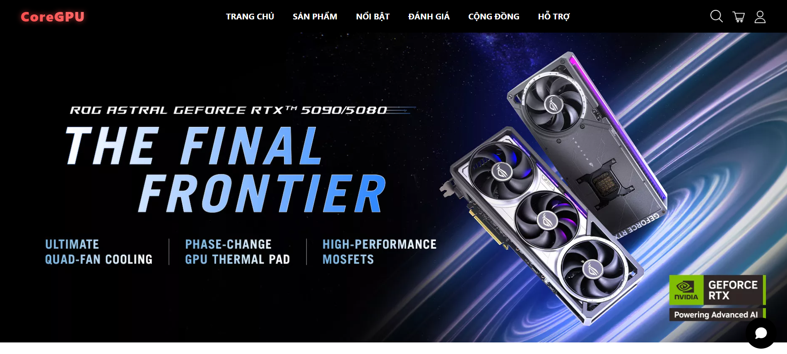

# 🛒 CoreGPU Fullstack E-Commerce Project

Welcome to the Fullstack E-Commerce Shopping Project repository! This project is a work in progress and aims to build a comprehensive e-commerce application using React.js for the front-end and Spring Boot for the backend. Once completed, it will offer a complete online shopping experience with features like product browsing, cart management, and order processing.

# 🛠️ Technologies Being Used
* Frontend: React.js, Bootstrap, Axios
* Backend: Spring Boot, Spring Security, Spring Data JPA
* Database: MySQL

# ✅ To-Do List
## Frontend
 * Set up React project structure
 * Implement a Home Page with different sections and a Footer
 * Pages Navigation & Categories Page with Filters
 * Product Detail Page
 * Shopping cart functionality
 * User authentication (sign-up, login, logout)
 * Checkout process
## Backend
 * Set up Spring Boot project
 * Implement basic product API
 * User authentication and authorization with JWT
 * Order processing and management
 * Integration with payment gateway
 * Admin dashboard for product/order management
## Database
 * Create MySQL database schema
 * Set up entity relationships (products, users, orders)
 * Seed database with initial data